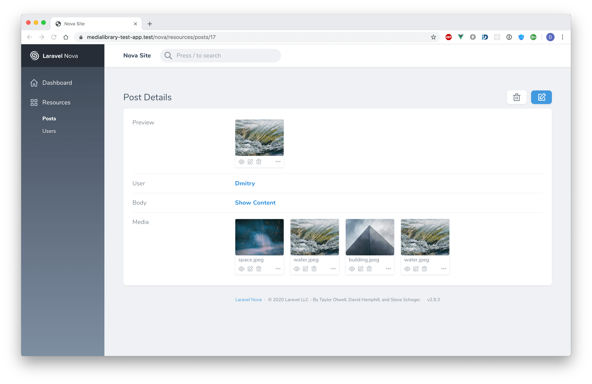
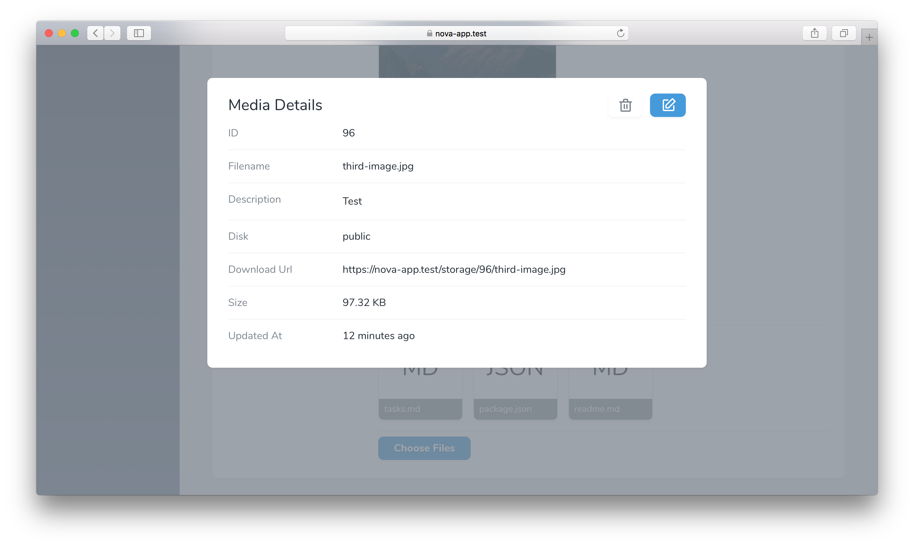
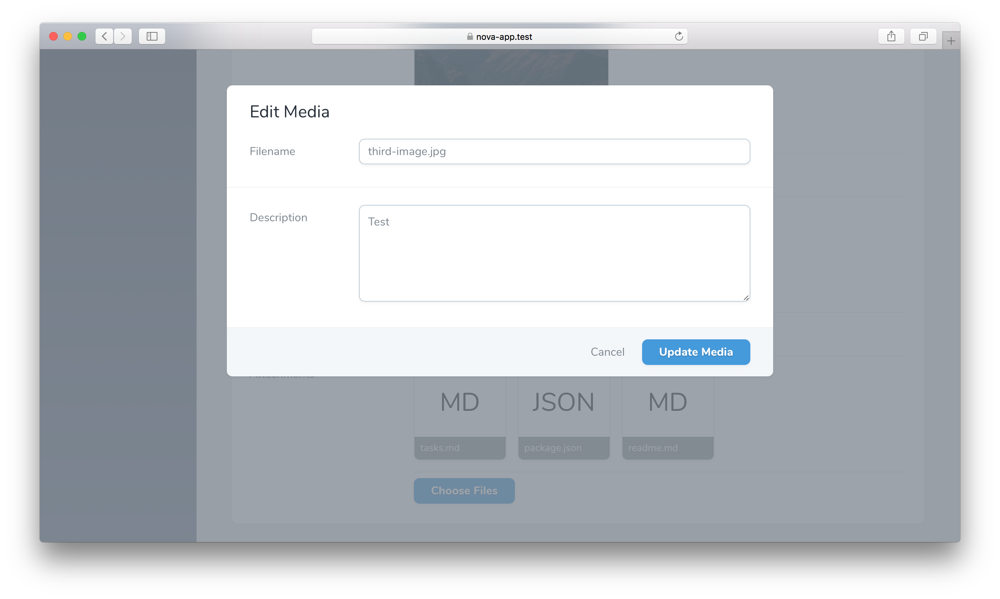
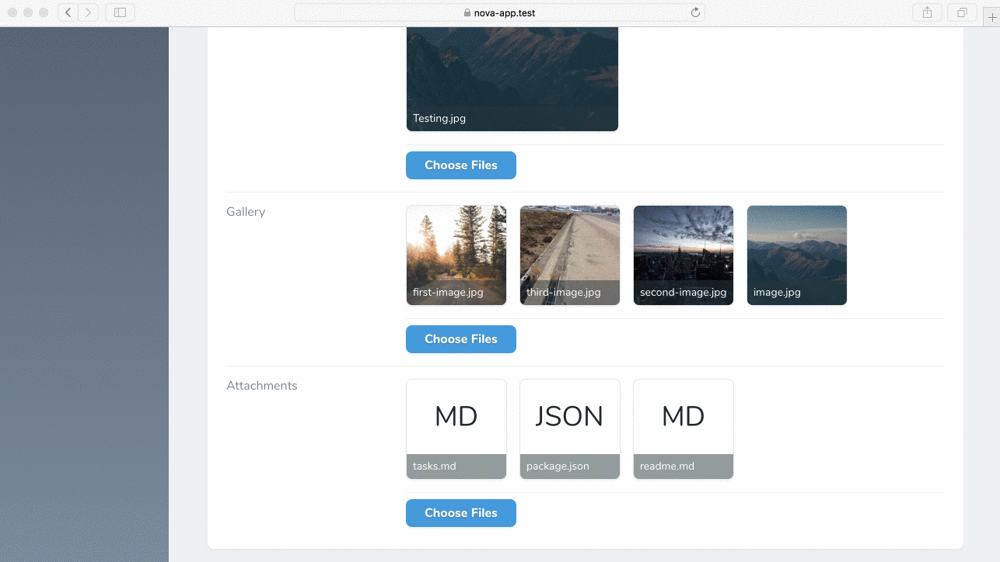
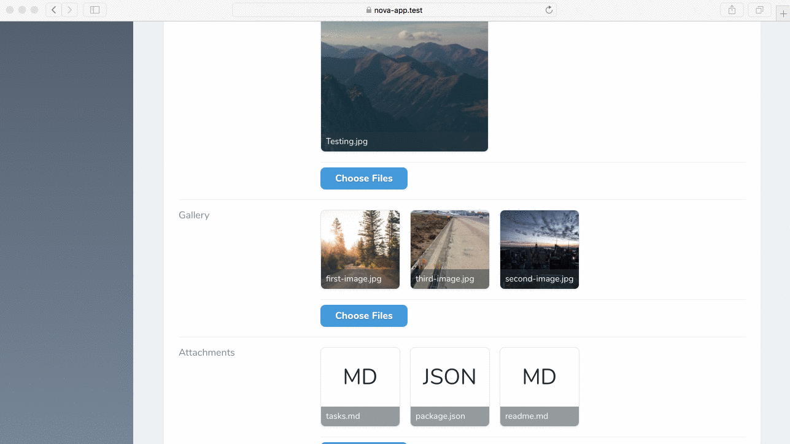

# Medialibrary Field for Laravel Nova

[](https://github.com/dmitrybubyakin/nova-medialibrary-field/releases)
[](https://packagist.org/packages/dmitrybubyakin/nova-medialibrary-field)
[](https://github.styleci.io/repos/162804399)

Laravel Nova field for managing the Spatie media library.

With this package you can:

 - create, update, delete and sort you media files
 - update media attributes (filename, custom properties, etc)
 - display media on the index view

## Contents

 - [Screenshots](#screenshots)
 - [Installation](#installation)
 - [Usage](#usage)
    - [What about forms?](#what-about-forms)
    - [Display media on the index view](#display-media-on-the-index-view)
    - [Custom media realation](#custom-media-realation)
    - [Thumbnail](#thumbnail)
    - [Single media collection](#single-media-collection)
    - [Store and Replace callbacks](#store-and-replace-callbacks)
    - [Validation](#validation)
    - [Sorting](#sorting)
    - [Custom media resource](#custom-media-resource)
 - [Changelog](#changelog)
 - [Alternatives](#alternatives)
 - [License](#license)

## Screenshots








## Installation

This package can be installed via command:

```bash
composer require dmitrybubyakin/nova-medialibrary-field
```

In your `NovaServiceProvider` register default media resource (only if you don't want to use your own one):

```php
public function boot()
{
    parent::boot();

    Nova::resources([
        \DmitryBubyakin\NovaMedialibraryField\Resources\Media::class,
    ]);
}
```

## Usage

```php
class Post extends Resource
{
    // ...
    public function fields(Request $request)
    {
        return [
            // ...
            Medialibrary::make('Images'), // it uses default collection

            Medialibrary::make('Images', 'post_images'), // you can use collection which you want

            Medialibrary::make('Images', 'post_images', MyMediaResource::class), // you can use own Media resource
        ];
    }
}
```

### What about forms?

Medialibrary field is shown only on index and details views. If there is any reason to show it on forms, let me know.

### Display media on the index view

```php
Medialibrary::make('Images')
    ->mediaOnIndex(), // display first media

Medialibrary::make('Images')
    ->mediaOnIndex(3), // display first 3 media

Medialibrary::make('Images')
    ->mediaOnIndex(function (Collection $mediaItems) {
        return $mediaItems->where('extension', 'jpg'); // filter media
    })
```

### Custom media realation

```php
class Post extends Model implements HasMedia
{
    public function featuredMedia(): MorphMany
    {
        return $this->media()->where('collection_name', 'featured');
    }
}

Medialibrary::make('Featured Image', 'featured')
    ->relation('featuredMedia'),
```

### Thumbnail

```php
Medialibrary::make('Featured Image', 'featured')
    ->thumbnail('thumbnailConversion'),

Medialibrary::make('Featured Image', 'featured')
    ->thumbnail(function (Media $media) {
        return 'https://dummyimage.com/300x300/ffffff/000000&text=' . strtoupper($media->extension);
    }),

Medialibrary::make('Featured Image', 'featured')
    ->thumbnail('thumbnailConversion')
    ->bigThumbnails(), // there are 8rem width for thumbnails by default. bigThumbnails makes them 2x larger
```

By default, thumbnails are available only for files which mime in `[image/jpeg, image/gif', image/png]`.

You can override it:

```php
Medialibrary::make('Featured Image', 'featured')
    ->imageMimes('image', 'mimes', 'that', 'you', 'need')
    ->thumbnail(...)
```

### Single media collection

```php
class Post extends Model implements HasMedia
{
    public function registerMediaCollections()
    {
        $this->addMediaCollection('featured')
            ->singleFile(); // just define it here
    }
}

Medialibrary::make('Featured Image', 'featured'), // nothing to do here
```

### Store and Replace callbacks

If you want to do someting before media saved, you can use `storeUsing` method. It accepts `FileAdder $fileAdder` as an argument (and must return it).

```php
Medialibrary::make('Images', 'post_images')
    ->storeUsing(function (FileAdder $fileAdder) {
        return $fileAdder->withCustomProperties(['description' => $this->resource->title]);
    })
```

When you are using a single media collection, you can also use `replaceUsing` method, which allows to you access to an old media.

```php
Medialibrary::make('Featured Image', 'featured')
    ->replaceUsing(function (FileAdder $fileAdder, Media $oldFile) {
        return $fileAdder
            ->usingFileName($oldFile->file_name)
            ->withCustomProperties($oldFile->custom_properties);
    })
```

### Validation

Validation works only when you store a new file.

```php
Medialibrary::make('Featured Image', 'featured')
    ->rules('max:1024', 'image')
    ->accept('image/*') // this is an attribute for input. <input type="file" accept="image/*">
```

### Sorting

```php
Medialibrary::make('Images', 'post_images')
    ->sortable()
```

### Custom media resource

```php
class MyMedia extends Resource
{
    public static $model = 'Spatie\MediaLibrary\Models\Media';

    public static $displayInNavigation = false;

    public function fields(Request $request): array
    {
        return [
            ID::make(),

            Text::make('Filename', 'file_name'),

            Textarea::make('Description', 'custom_properties->description')->alwaysShow(),

            Text::make('Size')->displayUsing(function () {
                return $this->resource->humanReadableSize;
            })->exceptOnForms(),
        ];
    }
}

class Post extends Resource
{
    public function fields(Request $request)
    {
        return [
            Medialibrary::make('Images', 'collection', MyMedia::class),
        ];
    }
}
```

## Changelog

Please see [CHANGELOG](CHANGELOG.md) for more information what has changed recently.

## Alternatives

 - https://github.com/jameslkingsley/nova-media-library
 - https://github.com/ebess/advanced-nova-media-library

## License

The MIT License (MIT). Please see [License File](LICENSE.md) for more information.
